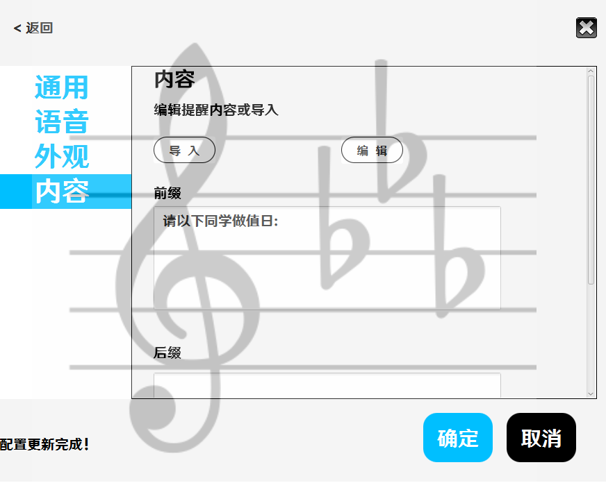
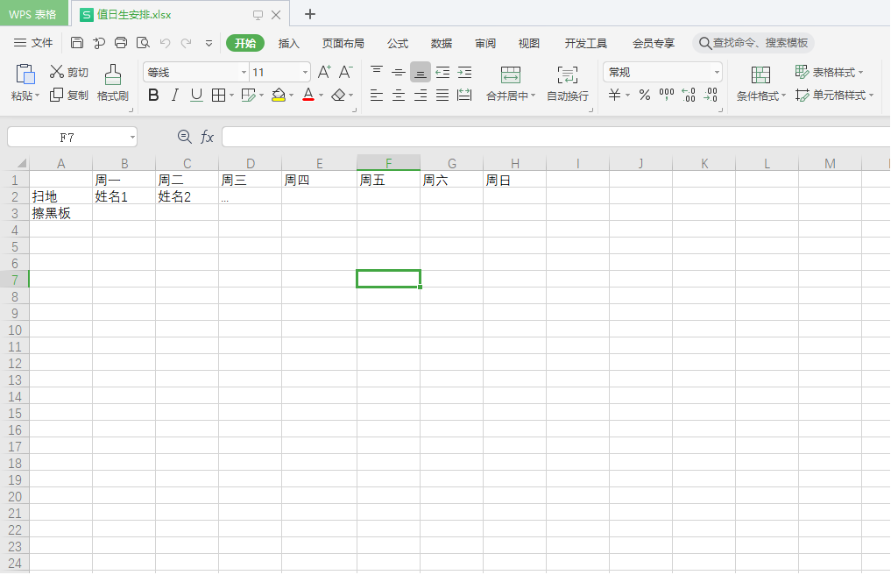

# 内容

在该界面中，你可以设置提醒内容

对于前缀和后缀，顾名思义，就是在提醒内容前和后的提示词，而上下午分解时间的设置是因为有的班级认为“中午”时间段应当由“上午”的值日生管，而有的认为应当由“下午”的值日生管。

对于提醒内容的设置，请点击`编辑`，你将看到这样一张表格：

这张表格的格式不应被更改，比如说将周日调到周一前什么的。

左边一列，正如你所见，应当填写扫地，擦黑板等项目，而其他部分应当填值日生姓名（可以一个格子写多个名字并以自己习惯使用的分隔符分割

对于这样的表格

---

|        | 周一  |
| ------ | ----- |
| 扫地   | 同学1 |
| 擦黑板 |       |
| 倒垃圾 | 同学2 |

这是被允许的，擦黑板一项将不会被显示

而

---

|        | 周一                                        |
| ------ | ------------------------------------------- |
| 扫地   | 同学1                                       |
|        | 同学2（这个地方无论有没有字符都不会被显示） |
| 倒垃圾 | 同学3                                       |

则同学2和同学3将不会被显示

对于上下午的配置

---

|              | 周一  |
| ------------ | ----- |
| 扫地（上午） | 同学1 |
| 扫地（下午） | 同学2 |

同学1将会在所设置的上下午分界时间之前显示，同学2则会在该时间之后显示，`（上午）` `（下午）`必须跟在该项名称最后，中英文括号不限