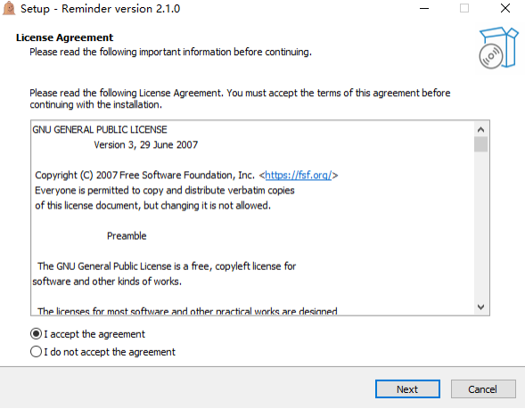
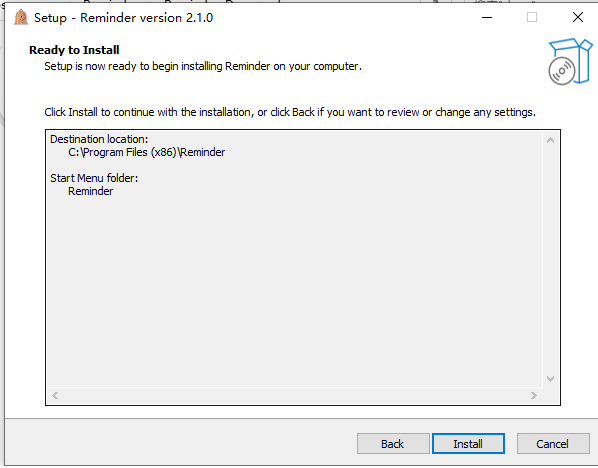
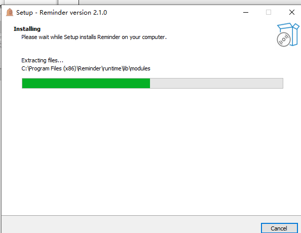
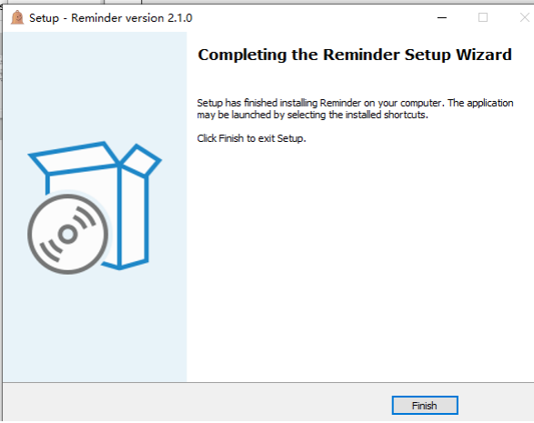

# 如何开始

1. 前往该项目的[GitHub界面](https://github.com/jpchs/Reminder)的Release中下载最新发布版本，选择`Reminder_setup.exe`

2. 打开文件，按提示进行安装

   

   

3. 完成安装

   

   

4. 重启或直接执行

->[系统托盘](./docs/托盘.md)

->[主界面](./docs/主界面.md)

