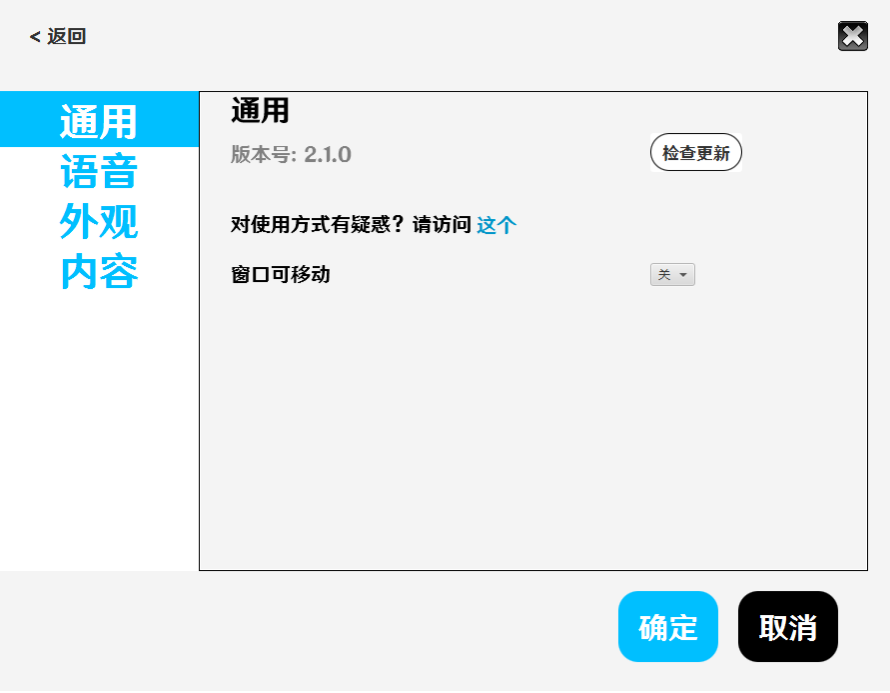
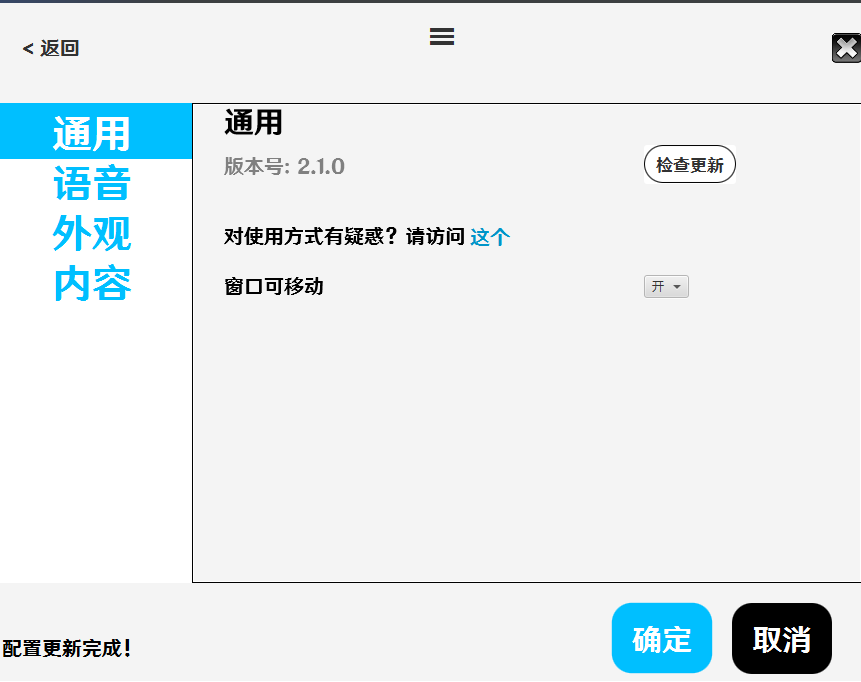

# 通用

你可以在通用设置中检查更新、查看文档和窗口移动

当你点击`检查更新`时，程序会自动检查更新，但由于是从`GitHub`下载，速度较慢且容易失败，建议手动前往release界面下载；此外当你更新时，请自行备份你的配置表格（详见[内容](./内容.md)）

当你点击那个叫`这个`的超链接的时候，会跳转到文档网页（就是你现在访问的这个网页）

当你将窗口可移动（默认为`关`）设置为`开`时，在页面顶端会出现三条横线，如图

拖动这个三横杠就可以移动窗口

